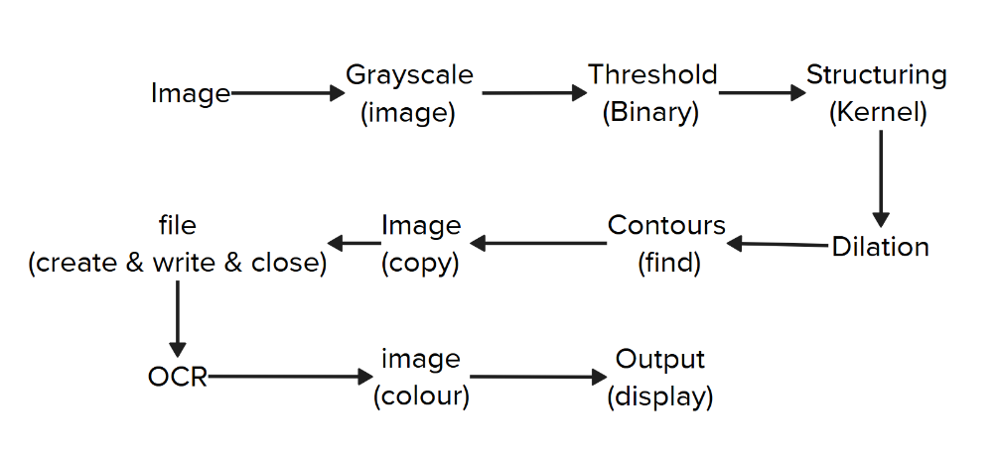

# VisionOCR 

The `VisionOCR` is an **OCR** (Optical Character Recognition) tool that detects text in an image, extracts it, and stores it as a separate text file.

## Tools

- Python 
- OpenCV 
- PyTesseract 
- Jupyter Notebook 

## Project Overview

In this project, I use two concepts **OpenCV** and **Pytesseract**, for *Image processing* and *Text Detection and Extraction*.
Let's see why i use these:

`opencv`:
- Image Processing
- To capture the image and read it

## Workflow

## License

This project is licensed under the [MIT License](LICENSE).  
Feel free to use, modify, and share with credit to **Sarawin R.**

